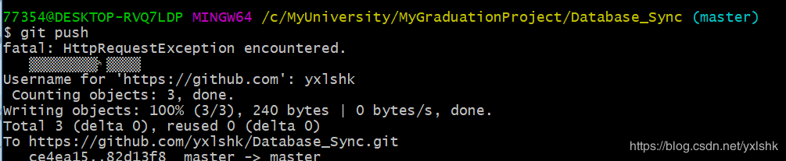

<!-- GFM-TOC -->
* [一、环境配置](#环境配置)
    * [gitlab](#gitlab)
* [二、git的使用](#git的使用)
    * [submodule](##submodule）
    * [添加submodules](###添加submodules）
    * [clone带有submodule的仓库](###clone带有submodule的仓库）
    * [修改submodule](###修改submodule）
<!-- GFM-TOC -->

# 一、环境配置

## 1. --winodws
### 1.1 TortoiseGit

TortoiseGit免密码
- PuTTy Key Generator 生成 密钥对；
- TortoiseGit setting-> Git -> Remote 中 putty key 填入保存的私钥文件即可

## 2. linux
### 2.1 git的安装

sudo apt-get install git
git --version

## 3. mac

mac默认带有git环境，不需要配置。

# 二、git的使用

## 1. submodule

### 1.1 添加submodules
git submoduel add ****1.git
git submoduel add ****2.git

### 1.2 clone带有submodule的仓库
git submodule init
git submoduel update

### 1.3 修改submodule
submodule clone之后不在任何分支上，所以修改前需要先切换到要修改的分支上
git checkout master

### 1.4 删除submodule
git没有提供删除submodule的命令，可通过以下几步彻底删除submodule

#### 1.4.1 删除物理文件夹
#### 1.4.2 删除.gitmodules文件中相关内容
#### 1.4.3 删除.git 目录中 config文件相关内容
#### 1.4.3 删除.git 目录中子目录modules中相关目录

git submodule的删除，如果不彻底，在重新添加submodule时很容易出现错误“A git directory for 'rrtcvideo' is found locally with remote”。可按照以上目录逐步进行。

### 1.5 用户名配置

解除之前配置的默认用户名
git config --unset user.name
git config --unset user.email

配置新的用户名
git config user.email "xxx"
git config user.email "xxx"

### 1.6 git stash 

在多人协同开发的时候，往往会出现push本地修改时，告知先让pull远程仓库代码---这种情况多发生于windows平台的git gui操作.
如果这个时候你直接pull，那很可能你本地的修改就全部丢失了。怎么办呢？git 提供了stash--暂存的功能。步骤如下：
1. git stash
2. git pull 拉取远程仓库代码
3. git stash pop stash{*}
4. git add **
5. git commit -m "xxx"
6. git push 
这样你的本地修改就完美的保留下来了

### 1.7 git status

查看本地git修改状态

### 1.8 版本回滚
#### 1.8.1 问题描述

在利用github实现多人合作程序开发的过程中，我们有时会出现错误提交的情况，此时我们希望能撤销提交操作，让程序回到提交前的样子，本文总结了两种解决方法：回退（reset）、反做（revert）。

#### 1.8.2 背景知识
git的版本管理，及HEAD的理解

使用git的每次提交，Git都会自动把它们串成一条时间线，这条时间线就是一个分支。如果没有新建分支，那么只有一条时间线，即只有一个分支，在Git里，这个分支叫主分支，即master分支。有一个HEAD指针指向当前分支（只有一个分支的情况下会指向master，而master是指向最新提交）。每个版本都会有自己的版本信息，如特有的版本号、版本名等。如下图，假设只有一个分支：

    
     

 

#### 1.8.3 解决方法
方法一：git reset

原理： git reset的作用是修改HEAD的位置，即将HEAD指向的位置改变为之前存在的某个版本，如下图所示，假设我们要回退到版本一：

    
     

 

    
     

 
适用场景： 如果想恢复到之前某个提交的版本，且那个版本之后提交的版本我们都不要了，就可以用这种方法。

具体操作：

1. 查看版本号：
可以使用命令“git log”查看：

    
     

 
也可以在github网站上查看：

    
     

 
2. 使用“git reset --hard 目标版本号”命令将版本回退：

    
     

再用“git log”查看版本信息，此时本地的HEAD已经指向之前的版本：

    
     

3. 使用“git push -f”提交更改：
此时如果用“git push”会报错，因为我们本地库HEAD指向的版本比远程库的要旧：

    
     

所以我们要用“git push -f”强制推上去，就可以了：

    
     

在github图形化界面上看，远程库的HEAD也已经指向目标版本：

    
     

回退成功！
方法二：git revert

原理： git revert的作用通过反做创建一个新的版本，这个版本的内容与我们要回退到的目标版本一样，但是HEAD指针是指向这个新生成的版本，而不是目标版本。如下图所示，假设我们要回退到版本一，版本四的内容和版本一是一样的：

    
     

    
     

适用场景： 如果我们想恢复之前的某一版本（该版本不是merge类型），但是又想保留该目标版本后面的版本，记录下这整个版本变动流程，就可以用这种方法。
具体操作：

1. 查看版本号：
可以通过命令行查看：

    
     

也可以通过github网站图形化界面查看：

    
     

2.使用“git revert -n 版本号”反做，并使用“git commit -m 版本名”提交：
（1）反做，使用“git revert -n 版本号”：

    
     

注意： 这里可能会出现冲突，那么需要手动修改冲突的文件。而且要git add 文件名。
（2）提交，使用“git commit -m 版本名”：

    
     

此时可以用“git log”查看本地的版本信息，可见多生成了一个新的版本：

    
     

3.使用“git push”推上远程库：

    
     

查看github上显示的远程库版本信息：

    
     

反做成功！