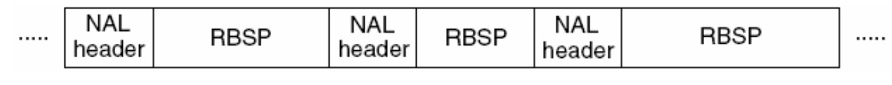
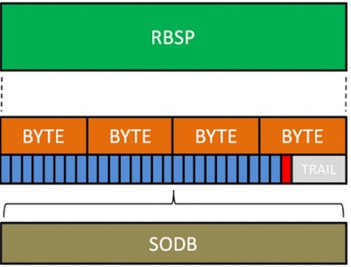

<!-- GFM-TOC -->
* [前言](#前言)
* [一、原理](#原理)
    * [1. NAL Header](##NALHeader)
    * [2. RBSP](##RBSP)
* [二、从NALU出发了解H.264里面的专业词语](#从NALU出发了解H.264里面的专业词语)
    * [1.Slice(片)](##Slice(片))
    * [2. 宏块(Macroblock)](##宏块(Macroblock))
    * [3.图像,场和帧](##图像,场和帧)
    * [4.图像,场和帧](##图像,场和帧)
    * [5.GOP](##GOP)
    * [6.IDR](##IDR)
* [三、帧内预测和帧间预测](#帧内预测和帧间预测)
    * [1.帧内预测（也叫帧内压缩）](##帧内预测（也叫帧内压缩）)
    * [2.帧间预测（也叫帧间压缩）](##帧间预测（也叫帧间压缩）)
* [四、延伸](#延伸)
* [五、参考链接](#参考链接)
<!-- GFM-TOC -->


# 前言
建议先看一下[FFmpeg3的iOS版的入门格式转换器(无编码)](http://www.iosxxx.com/),我们可以了解H264处于编解码层。为什么需要编码呢？比如当前屏幕是1280*720.一秒24张图片.那么我们一秒的视频数据是

```
1280*720(位像素)*24(张) / 8(1字节8位)(结果:B) / 1024(结果:KB) / 1024 (结果:MB) =  2.64MB
```

一秒的数据有2.64MB数据量。1分钟就会有100多MB。这对用户来说真心是灾难。所以现在我们需要一种压缩方式减小数据的大小.在更低 比特率(bps)的情况下依然提供清晰的视频。
H264: H264/AVC是广泛采用的一种编码方式。我们这边会带大家了解。从大到小排序依次是 序列，图像，片组，片，NALU，宏块，亚宏块，块，像素。

# 一.原理

H.264原始码流(裸流)是由一个接一个NALU组成，它的功能分为两层，VCL(视频编码层)和 NAL(网络提取层).

```
VCL(Video Coding Layer) + NAL(Network Abstraction Layer).
```
1.VCL：包括核心压缩引擎和块，宏块和片的语法级别定义，设计目标是尽可能地独立于网络进行高效的编码；

2.NAL：负责将VCL产生的比特字符串适配到各种各样的网络和多元环境中，覆盖了所有片级以上的语法级别。

在VCL进行数据传输或存储之前，这些编码的VCL数据，被映射或封装进NAL单元。（NALU）。

```
一个NALU = 一组对应于视频编码的NALU头部信息 + 一个原始字节序列负荷(RBSP,Raw Byte Sequence Payload).
```

如图所示，上图中的NALU的头 + RBSP 就相当于一个NALU(Nal Unit),每个单元都按独立的NALU传送。H.264的结构全部都是以NALU为主，理解了NALU，就理解了H.264的结构。
一个原始的H.264 NALU 单元常由 [StartCode][NALU Header][NALU Payload] 三部分组成，其中 Start Code 用于标示这是一个NALU 单元的开始，必须是”00 00 00 01” 或”00 00 01”
<div align="center">
    
    <br>
</div> 


## 1. NAL Header
由三部分组成，forbidden_bit(1bit)，nal_reference_bit(2bits)（优先级），nal_unit_type(5bits)（类型）。

<div align="center">
    
    <br>
</div> 
举例来说：

```
1.00 00 00 01 06:  SEI信息   
2.00 00 00 01 67:  0x67&0x1f = 0x07 :SPS
3.00 00 00 01 68:  0x68&0x1f = 0x08 :PPS
4.00 00 00 01 65:  0x65&0x1f = 0x05: IDR Slice
```

## 2. RBSP

<div align="center">
    
    <br>
</div> 
RBSP 序列举例

<div align="center">
    
    <br>
</div> 
RBSP 描述

SODB与RBSP
SODB 数据比特串 -> 是编码后的原始数据.
RBSP 原始字节序列载荷 -> 在原始编码数据的后面添加了 结尾比特。一个 bit“1”若干比特“0”，以便字节对齐。
<div align="center">
    
    <br>
</div>

# 二. 从NALU出发了解H.264里面的专业词语
<div align="center">
    
    <br>
</div>

```
1. 1帧 = n个片
2. 1片 = n个宏块
3. 1宏块 = 16x16yuv数据
```

## 1. Slice(片)
如图所示，NALU的主体中包含了Slice(片). 
```
1 一个片 = Slice Header + Slice Data
```
片是H.264提出的新概念，通过编码图片后切分通过高效的方式整合出来的概念。一张图片有一个或者多个片，而片由NALU装载并进行网络传输的。但是NALU不一定是切片，这是充分不必要条件，因为 NALU 还有可能装载着其他用作描述视频的信息.

那么为什么要设置片呢?
设置片的目的是为了限制误码的扩散和传输，应使编码片相互间是独立的。某片的预测不能以其他片中的宏块为参考图像，这样某一片中的预测误差才不会传播到其他片中。

可以看到上图中，每个图像中，若干宏块(Macroblock)被排列成片。一个视频图像可编程一个或更多个片，每片包含整数个宏块 (MB),每片至少包含一个宏块。
片有一下五种类型: 

| 片 | 意义|
| :--------: | :---------: |
| I 片    | 只包含I宏块 | 
| P 片    | 包含P和I宏块 | 
| B 片    | 包含B和I宏块 | 
| SP 片    | 包含P 和/或 I宏块,用于不同码流之间的切换 | 
| SI 片    | 一种特殊类型的编码宏块 | 

## 2. 宏块(Macroblock)

刚才在片中提到了宏块.那么什么是宏块呢？
宏块是视频信息的主要承载者。一个编码图像通常划分为多个宏块组成.包含着每一个像素的亮度和色度信息。视频解码最主要的工作则是提供高效的方式从码流中获得宏块中像素阵列。 

```
1. 一个宏块 = 一个16*16的亮度像素 + 一个8×8Cb + 一个8×8Cr彩色像素块组成。(YCbCr 是属于 YUV 家族的一员,在YCbCr 中 Y 是指亮度分量，Cb 指蓝色色度分量，而 Cr 指红色色度分量)
```


|宏块分类|    意义|
| :--------: | :---------: |
|I 宏块  |  利用从当前片中已解码的像素作为参考进行帧内预测|
|P 宏块   | 利用前面已编码图像作为参考进行帧内预测，一个帧内编码的宏块可进一步作宏块的分割:即16×16.16×8.8×16.8×8亮度像素块。如果选了8×8的子宏块，则可再分成各种子宏块的分割，其尺寸为8×8，8×4，4×8，4×4|
|B 宏块 |   利用双向的参考图像(当前和未来的已编码图像帧)进行帧内预测|

<div align="center">
    
    <br>
</div>

图示：句法元素的分层结构

在 H.264 中，句法元素共被组织成 序列、图像、片、宏块、子宏块五个层次。
句法元素的分层结构有助于更有效地节省码流。例如，再一个图像中，经常会在各个片之间有相同的数据，如果每个片都同时携带这些数据，势必会造成码流的浪费。更为有效的做法是将该图像的公共信息抽取出来，形成图像一级的句法元素，而在片级只携带该片自身独有的句法元素。 

<div align="center">
    
    <br>
</div>
宏块的句法单元

<div align="center">
    
    <br>
</div>

| 宏块分类  |   意义 | 
| :--------: | :---------: |
| mb_type |     确定该 MB 是帧内或帧间(P 或 B)编码模式，确定该 MB 分割的尺寸| 
| mb_pred  |    确定帧内预测模式(帧内宏块)确定表 0 或表 1 参考图 像，和每一宏块分割的差分编码的运动矢量(帧间宏块，除 8×8 宏块分割的帧内 MB)| 
| sub_mb_pred |     (只对 8×8MB 分割的帧内 MB)确定每一子宏块的子宏 块分割，每一宏块分割的表 0 和/或表 1 的参考图象;每一 宏块子分割的差分编码运动矢量。| 
| coded_block_pattern |     指出哪个 8×8 块(亮度和彩色)包 编码变换系数| 
| mb_qp_delta   |   量化参数的改变值| 
| residual  |   预测后对应于残差图象取样的编码变换系数| 


## 3.图像,场和帧
图像是个集合概念，顶 场、底场、帧都可以称为图像。对于H.264 协议来说，我们平常所熟悉的那些称呼，例如： I 帧、P 帧、B帧等等，实际上都是我们把图像这个概念具体化和细小化了。我们 在 H.264里提到的“帧”通常就是指不分场的图像；
视频的一场或一帧可用来产生一个编码图像。一帧通常是一个完整的图像。当采集视频信号时，如果采用隔行扫描(奇.偶数行),则扫描下来的一帧图像就被分为了两个部分,这每一部分就被称为 [场],根据次序氛围: [顶场] 和 [底场]。 

| 方式 |  作用域 | 
| :--------: | :---------: |
| 帧编码方式 |   活动量较小或者静止的图像宜采用 | 
| 场编码方式 |   活动量较大的运动图像 | 

<div align="center">
    
    <br>
</div>

## 4. I,P,B帧与pts/dts
| 帧的分类   | 中文 | 意义 |
| :--------: | :---------: | :--------: | 
|I帧  | 帧内编码帧,又称intra picture   |I 帧通常是每个 GOP（MPEG 所使用的一种视频压缩技术）的第一个帧，经过适度地压缩，做为随机访问的参考点，可以当成图象。I帧可以看成是一个图像经过压缩后的产物|
|P帧  | 前向预测编码帧,又称predictive-frame  |通过充分将低于图像序列中前面已编码帧的时间冗余信息来压缩传输数据量的编码图像，也叫预测帧|
|B帧 | 双向预测帧,又称bi-directional interpolated prediction frame |   既考虑与源图像序列前面已编码帧，也顾及源图像序列后面已编码帧之间的时间冗余信息来压缩传输数据量的编码图像,也叫双向预测帧|

I P B帧的不同:
I frame:自身可以通过视频解压算法解压成一张单独的完整的图片。<br>
P frame：需要参考其前面的一个I frame 或者B frame来生成一张完整的图片。<br>
B frame:则要参考其前一个I或者P帧及其后面的一个P帧来生成一张完整的图片。<br>

| 名称 |  意义 | 
| :--------: | :---------: |
| PTS(Presentation Time Stamp)  |   PTS主要用于度量解码后的视频帧什么时候被显示出来。| 
| DTS(Decode Time Stamp) |  DTS主要是标识内存中的bit流再什么时候开始送入解码器中进行解码。| 

<div align="center">
    
    <br>
</div>

DTS与PTS的不同:
DTS主要用户视频的解码，在解码阶段使用。PTS主要用于视频的同步和输出，在display的时候使用。再没有B frame的时候输出顺序一样。

## 5. GOP
GOP是画面组，一个GOP是一组连续的画面。
GOP一般有两个数字，如M=3，N=12.M制定I帧与P帧之间的距离，N指定两个I帧之间的距离。那么现在的GOP结构是 

```
1 I BBP BBP BBP BB I
```
增大图片组能有效的减少编码后的视频体积，但是也会降低视频质量，至于怎么取舍，得看需求了


## 6. IDR

一个序列的第一个图像叫做 IDR 图像（立即刷新图像），IDR 图像都是 I 帧图像。
I和IDR帧都使用帧内预测。I帧不用参考任何帧，但是之后的P帧和B帧是有可能参考这个I帧之前的帧的。IDR就不允许这样。
比如这种情况:
IDR1 P4 B2 B3 P7 B5 B6 I10 B8 B9 P13 B11 B12 P16 B14 B15 这里的B8可以跨过I10去参考P7

核心作用：
H.264 引入 IDR 图像是为了解码的重同步，当解码器解码到 IDR 图像时，立即将参考帧队列清空，将已解码的数据全部输出或抛弃，重新查找参数集，开始一个新的序列。这样，如果前一个序列出现重大错误，在这里可以获得重新同步的机会。IDR图像之后的图像永远不会使用IDR之前的图像的数据来解码。


# 五、参考链接
1.[新一代视频压缩编码标准H.264](http://read.pudn.com/downloads147/ebook/635957/%E6%96%B0%E4%B8%80%E4%BB%A3%E8%A7%86%E9%A2%91%E5%8E%8B%E7%BC%A9%E7%BC%96%E7%A0%81%E6%A0%87%E5%87%86H.264.pdf)<br>
2.[深入浅出理解视频编码H264结构](http://simplecodesky.com/2016/11/15/%E6%B7%B1%E5%85%A5%E6%B5%85%E5%87%BA%E7%90%86%E8%A7%A3%E8%A7%86%E9%A2%91%E7%BC%96%E7%A0%81H264%E7%BB%93%E6%9E%84)<br>
3.[关于视频的一些概念](http://www.samirchen.com/video-concept/)<br>
4.[I,P，B帧和PTS，DTS的关系](http://www.cnblogs.com/qingquan/archive/2011/07/27/2118967.html)<br>
